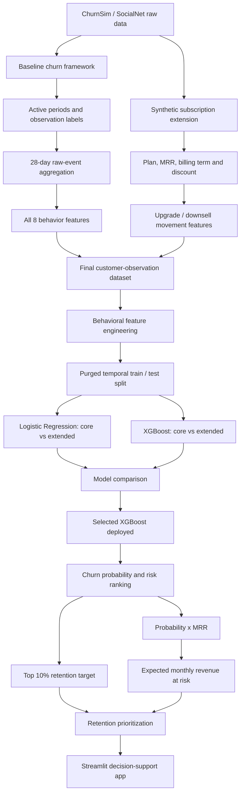

# Fighting Churn: Customer Churn Prediction & Retention Prioritization

An end-to-end machine learning portfolio project for identifying customers at risk of churn, comparing behavioral and subscription-aware models, and turning churn probabilities into retention priorities and expected monthly revenue at risk.

## Business problem

A subscription-based social media company wants to:

- identify customers likely to churn before cancellation;
- understand which behavioral and subscription signals are useful for prediction;
- prioritize a limited retention budget toward the highest-risk customers; and
- quantify recurring revenue exposure.

## Project evolution

This repository combines two stages of work.

### 1. Baseline churn framework

The `baseline/` directory preserves the learning and reproduction stage based on the churn-analysis workflow from Carl Gold's *Fighting Churn with Data* and the ChurnSim SocialNet simulation framework.

The baseline work covers:

- churn and retention SQL;
- active-period and observation construction;
- behavioral frequency, recency, ratio, tenure, and demographic features;
- skew / fat-tail feature handling;
- Logistic Regression;
- forecasting and validation concepts.

### 2. Extended churn solution

The final project extends the behavioral baseline with a richer synthetic subscription layer:

- Basic, Plus, and Premium plans;
- monthly recurring revenue (MRR);
- 1-, 3-, and 6-month billing commitments;
- discounts;
- upgrades and downsells;
- recent subscription-movement indicators;
- all eight SocialNet behavior types;
- additional engagement and behavioral-ratio features.

The final modeling workflow compares a behavior-only feature set with the extended behavior + subscription feature set. Under the stricter purged validation, the behavior-only XGBoost model has the strongest PR-AUC, so the project keeps subscription economics downstream for revenue-at-risk prioritization rather than forcing them into the churn-risk model.

## Project flow



The baseline work is retained under `baseline/` for methodology and learning history, while the final portfolio pipeline uses the cleaned datasets, final notebooks, saved models, SQL reconstruction, and Streamlit application.

## Data

The underlying customer behavior is simulated SocialNet / ChurnSim data. The subscription enrichment is a synthetic extension created for this project.

The final modeling dataset contains approximately 32.9K account-observation rows and is intentionally imbalanced, with churn representing about 2% of observations.

Behavioral inputs include:

- posts;
- new friends;
- likes;
- ad views;
- dislikes;
- unfriends;
- messages;
- replies.

Additional engineered features include total engagement, total activity, negative engagement, dislike rate, unfriend rate, reply rate, negative activity share, and ad-view share.

## SQL pipeline

The top-level `sql/` folder documents the final database-building logic:

- `sql/01_subscription_extension.sql` reconstructs the synthetic commercial layer used in the project: Basic / Plus / Premium plans, $10 / $20 / $35 base MRR, 1 / 3 / 6 month billing commitments, 0% / 5% / 10% billing discounts, and behavior-informed upgrade/downsell features.
- `sql/02_final_training_dataset.sql` creates the final account-observation modeling table by joining churn labels, demographics, account tenure, the subscription extension, and all eight behavioral event types aggregated directly from raw `socialnet7.event` data over a 28-day lookback window.

These two files are a cleaned portfolio reconstruction based on the final project schema, notebooks, application logic, and completed dataset. They document how the final pipeline was built, but are not presented as byte-for-byte copies of the original exploratory development commands.

A key final design choice was to calculate all eight behavioral features directly from the raw event table rather than attempting to repopulate missing legacy metric IDs.

## Modeling approach

The project uses a purged out-of-time split rather than relying only on a random split. Because the churn label looks forward approximately one month, training ends one month before the test period begins. The intervening observations are excluded as an embargo so training labels do not overlap the future evaluation window.

Models compared:

<!-- AUTO_MODEL_RESULTS_START -->
| Model | ROC-AUC | PR-AUC |
|---|---:|---:|
| Logistic - Core | 0.4373 | 0.0156 |
| Logistic - Extended | 0.4384 | 0.0156 |
| **XGBoost - Core** | **0.5747** | **0.0373** |
| XGBoost - Extended | 0.5721 | 0.0353 |

Best model by PR-AUC: **XGBoost - Core**.
<!-- AUTO_MODEL_RESULTS_END -->

The deployed application uses the **XGBoost - Core** model selected from the XGBoost variants by purged-test PR-AUC. Subscription economics remain available downstream for revenue-at-risk prioritization even when they do not improve churn ranking. The comparison table above is refreshed by the reproducible retraining script whenever the model outputs are rebuilt.

Because churn is rare, PR-AUC and lift are emphasized alongside ROC-AUC rather than using accuracy as the primary metric.

## Retention targeting results

On the out-of-time test set:

<!-- AUTO_RETENTION_RESULTS_START -->
- 11,645 customers were scored;
- 188 churners were observed;
- baseline churn rate was **1.61%**;
- targeting the highest-risk 10% selected 1,165 customers;
- that group captured **39 of 188 churners (20.74%)**;
- churn rate inside the targeted group was **3.35%**;
- lift versus random targeting was **2.07x**.
<!-- AUTO_RETENTION_RESULTS_END -->

## Revenue-at-risk prioritization

Expected monthly revenue at risk is defined as:

```text
churn probability × current MRR
```

Across the test set:

<!-- AUTO_REVENUE_RESULTS_START -->
- expected monthly revenue at risk: **$3,697.86**;
- expected monthly revenue at risk in the top-risk 10%: **$1,655.04**;
- the top-risk 10% therefore concentrates about **44.8%** of modeled monthly revenue exposure.
<!-- AUTO_REVENUE_RESULTS_END -->

This is an expected-value prioritization metric, not a guaranteed revenue-loss estimate.

## Streamlit application

`app.py` provides two views:

- **Business Stakeholder View** — customer-level churn scoring, retention priority, and expected monthly revenue at risk;
- **Technical View** — project evolution, feature engineering, model comparison, retention performance, and limitations.

The manual customer-input form is a portfolio demonstration. In production, the same features would typically be populated automatically from customer activity and subscription systems.

## Repository structure

```text
fighting_with_churn/
├── app.py
├── README.md
├── requirements.txt
├── baseline/
│   ├── data/
│   ├── figures/
│   ├── notebooks/
│   └── sql/
├── data/
├── models/
├── notebooks/
├── scripts/
│   └── retrain_models.py
├── sql/
│   ├── 01_subscription_extension.sql
│   └── 02_final_training_dataset.sql
└── simulation_reference/
    └── socialnet7/
```

### Key final files

```text
data/churn_training_final.csv
data/churn_modeling_ready.csv
data/final_model_comparison.csv
data/xgboost_test_predictions.csv
data/high_priority_retention_customers.csv

models/logistic_regression_extended.pkl
models/xgboost_extended.pkl

notebooks/01_data_validation_and_eda.ipynb
notebooks/02_exploratory_analysis_feature_engineering.ipynb
notebooks/04_logistic_regression.ipynb
notebooks/05_xgboost_backtest.ipynb
notebooks/06_retention_business_analysis.ipynb

sql/01_subscription_extension.sql
sql/02_final_training_dataset.sql

scripts/retrain_models.py
```

## Run locally

The saved models and notebooks were built with Python 3.12.13 and the pinned package versions in `requirements.txt`. Clone the repository and install the dependencies:

```bash
git clone https://github.com/htoor2026/fighting_with_churn.git
cd fighting_with_churn
python -m pip install -r requirements.txt
```

Start the Streamlit application:

```bash
python -m streamlit run app.py
```

Then open the local Streamlit URL shown in the terminal.

### Rebuild the model outputs

After changing modeling code, regenerate the purged-validation models and business outputs with:

```bash
python scripts/retrain_models.py
```

The rebuild script retrains Logistic Regression and XGBoost, refreshes both saved models, test predictions, model-comparison CSVs, the high-priority retention file, `data/project_metrics.json`, and the auto-generated result blocks in this README.

## Important limitations

- The underlying behavioral data is simulated rather than proprietary production customer data.
- The richer subscription layer is a synthetic project extension.
- Subscription movements were added after the original churn simulation, so upgrade/downsell relationships should not be interpreted causally.
- Feature importance reflects predictive contribution, not causal impact.
- Model performance is useful for ranking and targeting, but it is not sufficient evidence that any specific retention treatment will reduce churn.

## Portfolio takeaway

This project demonstrates the full churn workflow: SQL-based customer analytics, feature engineering, temporal model validation, Logistic Regression and XGBoost comparison, retention lift analysis, revenue-at-risk prioritization, and deployment in a Streamlit decision-support application.
